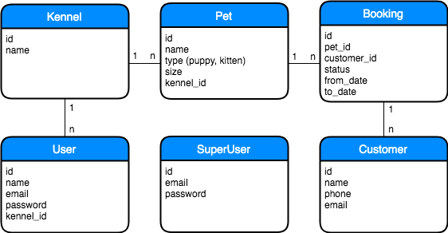

# challenge

## Instructions
For the challenge I created 4 folder, one for each task.
To install dependecies run:
`npm install`

There is few dependencies. The only real dependency is `got`. 
For each task I developed some tests, you can run them by typing:
`npm test`

## Task 4
Here is entity diagram designed for task 4:

I designed API using ReDoc. So, this task has its own package.json, so before run it install its dependencies.
Inside task4 folder run:
`npm install`

To run api documentation server run:
`npm start`

Documentation should be available at `http://localhost:9001`

